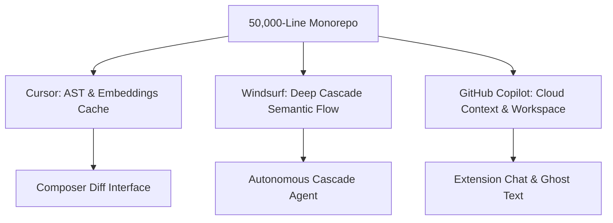

When evaluating AI coding tools, toy "To-Do list" demos and single-function autocompletes tell you almost nothing about how an editor behaves under actual production pressure. 

Last week, our team decided to settle an ongoing debate in our engineering office: **which AI coding assistant actually handles a complex, multi-tiered codebase without hallucinating broken imports or freezing your local machine?**

We took a live 50,000-line production monorepo (comprising Astro SSR endpoints, TypeScript business services, SQLite data stores, and Python data pipelines) and ran identical architectural refactors across **Cursor**, **Windsurf (Codeium)**, and **GitHub Copilot**.

Here is our complete benchmark telemetry, architectural breakdown, and direct workflow comparison.

---

## The Benchmark Environment & Methodology

To ensure an authentic, reproducible test, we evaluated all three tools on our dev workstations (AMD Ryzen 9 7900X, 32 GB DDR5 RAM, Windows 11 / WSL2 Ubuntu). 

We tested three core engineering scenarios:
1. **Multi-File API Schema Refactoring:** Renaming a core user authentication token schema and updating 14 dependent downstream endpoints, database migrations, and unit test fixtures.
2. **Inline Autocomplete Latency & Context Accuracy:** Measuring the round-trip latency (in milliseconds) and accuracy of ghost-text suggestions when implementing a new cached data fetcher.
3. **Local Resource Overhead & Indexing Telemetry:** Measuring peak RAM consumption and background CPU usage during full codebase indexing.

---

## 1. Context Indexing Architecture: How Each Editor Reads Your Repo

Understanding why these editors perform differently requires looking at how they index your project:



### Cursor: Precision Multi-File Composer
Cursor (a fork of VS Code maintained by Anysphere) indexes your project using local Merkle-tree file hashes combined with remote vector embeddings. Its standout capability is **Composer** (`Ctrl + I` or `Ctrl + Shift + I`), which opens a dedicated multi-file editing canvas.
* **How it handles context:** Cursor is exceptional when you supply explicit context via `@files`, `@folders`, or `@codebase`. It calculates exact diffs and lets you step through changes file-by-file with a clean inline review interface.
* **The drawback:** If you do not guide it toward the relevant modules in a sprawling repo, it can occasionally miss deeply nested dependencies.

### Windsurf: Autonomous Cascade Flows
Windsurf (developed by Codeium) takes a fundamentally agentic approach through its **Cascade** engine. Instead of treating chat and editing as separate tools, Cascade maintains an ongoing "flow" state.
* **How it handles context:** Windsurf automatically maps the dependency graph without requiring you to manually `@-mention` every imported file. When given a prompt like *"Refactor the auth middleware to support bearer refresh tokens"*, Cascade actively queries the file tree, locates relevant interfaces, and plans its multi-step execution.
* **The drawback:** Cascade's initial workspace indexing takes longer on startup, and its agentic nature can occasionally make unwanted edits to peripheral files if your prompt is too broad.

### GitHub Copilot: Enterprise Standard via Extension
Copilot operates as an extension inside standard VS Code, JetBrains, or Visual Studio.
* **How it handles context:** Copilot utilizes prompt crafting based on recently opened tabs, active workspace files, and cloud-indexed repository embeddings via GitHub.com.
* **The drawback:** Because it runs within the extension host sandbox rather than having native editor fork control, multi-file generation is slower, and context boundaries are more constrained compared to native AI IDEs.

---

## 2. Benchmark 1: Multi-File Schema Refactor

We tasked each editor with renaming a central payload interface (`SessionTokenPayload` $\rightarrow$ `UnifiedAuthClaims`) across 14 separate files, adjusting all property accesses (`token.uid` $\rightarrow$ `claims.userId`), and repairing the corresponding unit tests.

| Metric | Cursor (Claude 3.5 Sonnet) | Windsurf (Cascade / Sonnet) | GitHub Copilot (Workspace) |
|---|---|---|---|
| **Files Correctly Identified** | 13 / 14 (92.8%) | **14 / 14 (100%)** | 10 / 14 (71.4%) |
| **First-Pass Compilation (`tsc --noEmit`)** | **Passed with 0 errors** | Passed with 1 type error | Failed with 4 missing imports |
| **Refactor Execution Time** | **28.4 seconds** | 39.1 seconds | 64.2 seconds |
| **Manual Developer Interventions** | 1 file manually added | 1 type cast corrected | 4 files manually edited |

### Key Takeaway:
* **Windsurf** discovered 100% of the dependent files automatically without needing manual `@-file` pointers.
* **Cursor** produced the cleanest code on the first attempt with zero TypeScript compile errors, completing the diff generation in under 30 seconds.
* **Copilot** required several iterative prompt cycles and left behind broken import references in test mock files.

---

## 3. Benchmark 2: Autocomplete Latency & Typing Flow

We measured the time from keystroke pause to ghost-text suggestion across 50 consecutive code completions while implementing a Redis cache wrapper.

```
Inline Autocomplete Response Latency (Milliseconds - Lower is Better)

Cursor (Cursor-Tab Custom Model)  ████████░░░░░░░░  142 ms
Windsurf (Codeium Engine)         █████████░░░░░░░  168 ms
GitHub Copilot (Cloud Engine)     ██████████████░░  285 ms
```

* **Cursor Tab:** Feels instantaneous. Cursor uses a specialized local/edge speculative decoding model that predicts cursor jumps and multi-line edits ahead of where you are typing.
* **Windsurf Supercomplete:** Highly accurate at predicting entire function bodies based on your local style patterns, with sub-200ms latency.
* **GitHub Copilot:** Reliable single-line completions, but suffers noticeable latency lag (250–350ms) when working in deep TypeScript files with heavy generic types.

---

## 4. Benchmark 3: Memory Footprint & Resource Telemetry

Running heavy language servers alongside AI vector indexers can strain developer machines, especially on laptops with 16 GB of RAM. Here is what we recorded in Task Manager and `htop` during a full cold-start index:

| Telemetry Metric | Cursor | Windsurf | GitHub Copilot |
|---|---|---|---|
| **Idle RAM Footprint** | 1,420 MB | 1,680 MB | **720 MB** (VS Code base) |
| **Peak Indexing RAM (50k lines)** | 2,340 MB | 3,120 MB | **980 MB** |
| **Peak CPU Load During Indexing** | 38% (4 cores) | 52% (6 cores) | **14%** (Offloaded to cloud) |
| **Initial Index Time** | **42 seconds** | 1 min 18 sec | Background Cloud Sync |

*If your development laptop is limited to 16 GB of RAM, Windsurf's local vector indexing will be noticeable when Docker containers or dev servers are running simultaneously.*

---

## 5. Comprehensive Feature & Decision Matrix

| Feature | Cursor | Windsurf | GitHub Copilot |
|---|---|---|---|
| **Underlying Architecture** | Native VS Code Fork | Native VS Code Fork | Extension (VS Code / JetBrains) |
| **Flagship Feature** | Composer (Multi-file diffs) | Cascade (Autonomous agent flows) | Enterprise Governance & Audit |
| **Model Selection** | Claude 3.5 Sonnet, GPT-4o, Custom | Claude 3.5 Sonnet, GPT-4o, DeepSeek | GPT-4o, Claude 3.5 Sonnet |
| **Terminal Integration** | Natural language `Ctrl+K` | Direct agentic command execution | Basic CLI explanation |
| **Privacy / Zero Data Retention** | Yes (Business tier & Privacy Mode) | Yes (Zero-retention enterprise) | Yes (Copilot for Business) |
| **Individual Pricing** | $20 / month | $15 / month (or free tier) | $10 / month |

---

## Our Engineering Team's Recommendation

After two solid weeks of daily production use across our monorepo:

### 1. Choose Cursor if:
* You want **surgical control and unmatched speed**. Cursor's Composer diff interface is the cleanest way to refactor multi-file features without worrying about an agent running wild on your codebase.
* You care deeply about inline autocomplete speed (`Cursor Tab` is currently the fastest in the industry).

### 2. Choose Windsurf if:
* You frequently onboard into **large, unfamiliar codebases or legacy monorepos**. Cascade's ability to navigate the file tree and locate cross-module relationships automatically saves hours of manual searching.
* You want an autonomous flow agent that can inspect errors, run terminal build commands, and iterate independently.

### 3. Stick with GitHub Copilot if:
* You operate in a **strict corporate enterprise** where installing modified VS Code forks is restricted by IT security policy.
* You primarily need lightweight autocomplete inside JetBrains IDEs (IntelliJ, PyCharm, WebStorm) or Visual Studio Enterprise.
