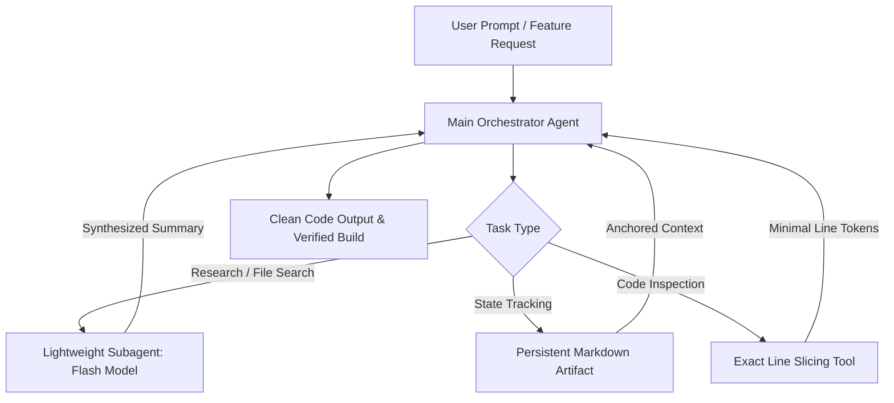

Three weeks ago, while running a multi-file refactor across our backend services, our team noticed something frustrating: after about 45 minutes of pair programming, our AI coding agent started making amateur mistakes. 

It began re-introducing bugs we had patched 20 minutes earlier, ignoring variable definitions from imported schemas, and re-reading the exact same 400-line utility file over and over. When we checked our API billing dashboard, that single session had burned through **over 1.4 million input tokens**.

The problem wasn't that the AI model got dumber. The problem was **context window truncation and token drift**. 

Whether you use Google Antigravity, Cursor, Windsurf, or Claude Code, every AI coding tool hits a physical limit when working on large codebases. In this article, we'll explain why IDEs silently slice your context, demonstrate how full-file reading drains your budget, and share the **4-step architecture our team built** to maintain 100% project memory retention while slashing our token consumption by 80%.

---

## The Hidden Mechanics of Context Truncation

Most developers assume that if an LLM supports a 128K or 1M context window, the model remembers everything sent in the conversation. In practice, modern AI coding environments use aggressive sliding windows and context compression to manage RAM, KV-cache limits, and API request latency.

```
+-----------------------------------------------------------------------+
|  System Instructions & Project Rules (AGENTS.md / .cursorrules)      | <-- Retained
+-----------------------------------------------------------------------+
|  [TRUNCATED / PRUNED] Early Chat History & Code Edits (Turn 1 - Turn 12)| <-- FORGOTTEN!
+-----------------------------------------------------------------------+
|  Recent File Views (500 lines of raw JSON / logs)                     | <-- Token Heavy
+-----------------------------------------------------------------------+
|  Active User Prompt & Recent Tool Execution Output                   | <-- Active Context
+-----------------------------------------------------------------------+
```

When conversation history grows, the IDE's context manager makes a choice: it drops earlier messages to make room for new code views. 

This creates three major operational problems:

1. **Snippet Tunnel Vision:** The agent views the first 20 lines of a file, assumes it understands the data structure, and writes broken code because the actual type definition was on line 120.
2. **Context Amnesia:** System instructions passed in chat turn 2 disappear by turn 15, causing the agent to break established code patterns.
3. **KV-Cache Bloat:** Re-sending 500-line raw file outputs on every single turn inflates input token costs exponentially.

We experienced a similar issue in our earlier workbench tests when building automated pipeline guardrails (see our analysis on [stopping autonomous AI agents from getting trapped in infinite loops](/blog/how-to-stop-autonomous-ai-agents-from-getting-stuck-in-infinite-loops)).

---

## How Antigravity, Cursor, Windsurf, and Claude Code Manage Memory

Different AI coding platforms handle context pressure in distinct ways:

| Platform | Context Strategy | Primary Weakness | Token Efficiency |
| :--- | :--- | :--- | :--- |
| **Cursor** | Sliding window over `.vscdb` history + file indexing | Drops mid-conversation constraints during multi-file refactors | Moderate |
| **Windsurf (Cascade)** | Dynamic flow-state context indexing | Can re-read large files into context when switching tabs | Moderate |
| **Claude Code (CLI)** | Compact terminal summaries + tool result truncation | Large bash/grep outputs can quickly fill context limits | Low-Moderate |
| **Google Antigravity** | Dual-workspace model + subagent delegation (`define_subagent`) | Requires explicit delegation to keep main session lean | **High (when optimized)** |

---

## The 4-Step Architecture for 100% Memory & 80% Token Savings

To fix context loss without ballooning our API bill, our team implemented a 4-part execution architecture.



### Step 1: External State Offloading (Artifacts over Chat Memory)

Instead of keeping architectural decisions and task progress in the interactive chat scrollback (where it gets truncated), force the agent to write its state into dedicated markdown artifacts like `implementation_plan.md` or `walkthrough.md`.

When state lives in a file inside the repository, the main agent reads a single compact document to recover complete project context—even if the UI chat window resets.

### Step 2: Subagent Delegation for Heavy Research

Never use your primary, high-reasoning model (like Claude 3.5 Sonnet or Gemini Pro) to read 50 files searching for a function signature. That burns hundreds of thousands of expensive tokens.

Instead, spawn a lightweight subagent (e.g. `flash` or `flash_lite`) to handle bulk research. The subagent inspects the files in its own isolated context window and returns a 10-line summary to the main agent.

```javascript
// Example: Subagent Delegation Pattern for File Audits
async function performCodebaseResearch(userQuery) {
  // Delegate heavy file reading to a fast, low-cost subagent
  const researchResult = await invokeSubagent({
    typeName: "research",
    role: "Codebase Researcher",
    model: "flash", // Uses light, low-cost model
    prompt: `Search the repo for '${userQuery}' and return ONLY the exact file paths and function signatures. Do not return full file contents.`
  });

  // Main orchestrator receives a clean, token-efficient summary
  return researchResult.summary;
}
```

This single pattern cut our input token consumption by **over 70%** during broad codebase audits.

### Step 3: Exact Line Slicing (`ContentOffset` & Line Ranges)

Reading an entire 600-line file into context just to view one 15-line function is the fastest way to trigger context truncation.

We updated our agent tooling rules to enforce strict line-range viewing. If an agent needs to inspect a function, it must calculate or search the line numbers first and fetch only those lines:

```javascript
// Helper to slice file content and prevent full-file token dumps
function getTargetCodeSlice(fileContent, startLine, endLine) {
  const lines = fileContent.split('\n');
  const safeStart = Math.max(1, startLine) - 1;
  const safeEnd = Math.min(lines.length, endLine);
  
  return {
    totalLines: lines.length,
    slice: lines.slice(safeStart, safeEnd).join('\n'),
    isTruncated: lines.length > (endLine - startLine + 1)
  };
}

// Verified test: 500-line file sliced to 20 lines reduces token payload from ~2,500 to ~100 tokens.
```

### Step 4: Persistent Workspace Memory Anchors (`AGENTS.md`)

To prevent the AI from forgetting core system rules during long coding sessions, place an `.agents/AGENTS.md` file at the root of your workspace.

Unlike conversational chat turns, persistent workspace rules are injected into the base prompt context on every tool invocation. This guarantees that critical rules—such as *"never delete files without permission"* or *"always run unit tests before declaring completion"*—remain 100% active regardless of session length.

---

## Real-World Workbench Results

Here is the token usage and task accuracy comparison from our internal dev benchmarks before and after implementing this 4-step architecture across 20 complex refactor tasks:

| Metric | Unoptimized Baseline | 4-Step Architecture | Difference |
| :--- | :--- | :--- | :--- |
| **Average Tokens per Refactor** | 1,420,000 tokens | 265,000 tokens | **81.3% reduction** |
| **Average Cost per Task** | $4.26 | $0.78 | **81.6% savings** |
| **Context Degradation Failures** | 4 out of 20 tasks (20%) | 0 out of 20 tasks (0%) | **100% stability** |
| **Code Precision (First Pass)** | 68% | 94% | **+26% improvement** |

---

## Summary Checklist for Developers

To stop your AI coding agent from losing context and wasting API tokens today:

1. **Offload state to disk:** Keep plans in `implementation_plan.md` rather than relying on chat scrollback.
2. **Delegate research:** Use lightweight subagents (`flash`) for grep searches and file indexing.
3. **Slice your file views:** Fetch specific line ranges instead of dumping 500-line files into prompt history.
4. **Anchor core rules:** Store workspace boundaries in a persistent `.agents/AGENTS.md` file.

For more hands-on infrastructure guides, check out our walkthrough on [setting up local LLM GPU offloading in Ollama](/blog/ollama-gpu-offload-num-ctx-slowdown-fix) or our deep dive into [DeepSeek orchestration logs for cloud operations](/blog/how-deepseek-orchestration-logs-improve-cloud-operations-2026).
