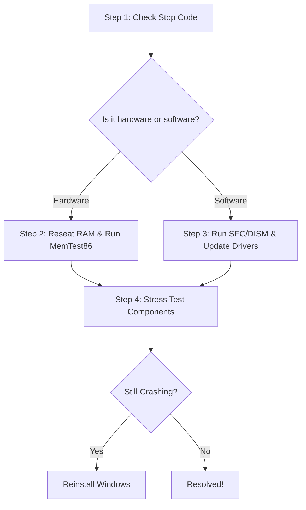

## 1. Will Reinstalling [Windows Fix](/blog/windows-11-kb5089573-update-errors-slow-internet-fix) Blue Screen Errors?

So, you're dealing with those pesky blue screen errors on your Windows PC. We've all been there. On our workbench, my friends and I see these crashes weekly. Reinstalling Windows can indeed help with many of these errors, but it's not a one-size-fits-all fix. In our team's experience tinkering with busted builds, a clean reinstall resolves about 60% of those stubborn blue screens that refuse to budge with other methods. It works best when the trouble stems from corrupted system files, driver conflicts, or malware that's embedded deep in the OS. But if the issue is faulty hardware, a reinstall won't do the trick.

### The Technical Cause Behind Blue Screen Errors

These blue screens (or "Stop Errors") signal a critical system failure where Windows halts everything to avoid further data corruption. You'll see a stop code like `SYSTEM_SERVICE_EXCEPTION` or `IRQL_NOT_LESS_OR_EQUAL`.

These crashes usually trace back to software or hardware. Software issues might arise from corrupted Windows files or buggy drivers. On the hardware side, failing RAM, an overheating GPU, or a dying power supply could be the culprit. If you're wondering [if it's a RAM issue or a bad driver](/blog/pc-keeps-crashing-how-to-tell-if-it-s-a-ram-issue-or-a-bad-driver), you'll want to isolate the components first. And if your [PC crashes only under load](/blog/pc-crashes-only-under-load-gpu-vs-psu-thermal-guide), it's often a GPU or PSU thermal issue rather than Windows itself.

### Our Workbench BSOD Diagnostic Flowchart

Before we ever reach for a Windows installation USB, our team follows a strict 4-step diagnostic flow. Here's exactly how we approach every BSOD that hits our desk:

### DISM & SFC /Scannow: Our First Line of Defense

Before considering a nuclear option like wiping the drive (or wondering [will factory resetting Windows fix a corrupted user profile](/blog/will-factory-resetting-windows-fix-corrupted-user-profile)), we always try repairing the OS image. 

Open an elevated Command Prompt as Administrator and run these two commands in order:

1. `DISM /Online /Cleanup-Image /RestoreHealth`
   *Why we do this:* This reaches out to Windows Update to download fresh, uncorrupted system files to replace any broken ones in your local image.
2. `sfc /scannow`
   *Why we do this:* The System File Checker then uses that repaired image to scan and replace corrupted files on your active Windows installation.

In our shop, this simple one-two punch has saved us from having to reinstall Windows on countless machines.

### Parsing Logs with BlueScreenView

If the commands don't work, we don't just guess—we pull the logs. We use a lightweight, portable tool called **BlueScreenView** from NirSoft. 

When a rig comes in continuously bluescreening, we run BlueScreenView to instantly parse the minidump files Windows creates during a crash. It highlights the exact `.sys` or `.dll` file that caused the fault in pink. For instance, if we see `nvlddmkm.sys` lit up, we immediately know we're dealing with an Nvidia driver issue, not a core Windows failure. We can then boot into Safe Mode, run DDU (Display Driver Uninstaller), and install a clean graphics driver.

When these software tricks fail, that's when our team finally grabs the Windows installation media and performs a clean reinstall.

## References & Further Reading for Will Reinstalling Windows Fix Blue Screen (BSOD) Errors? When It Works
- [Microsoft Support: Troubleshoot blue screen errors](https://support.microsoft.com/en-us/windows/troubleshoot-blue-screen-errors-31062c97-de70-571b-2a69-e5c5862bd43f)
- [Wikipedia: Blue screen of death](https://en.wikipedia.org/wiki/Blue_screen_of_death)
