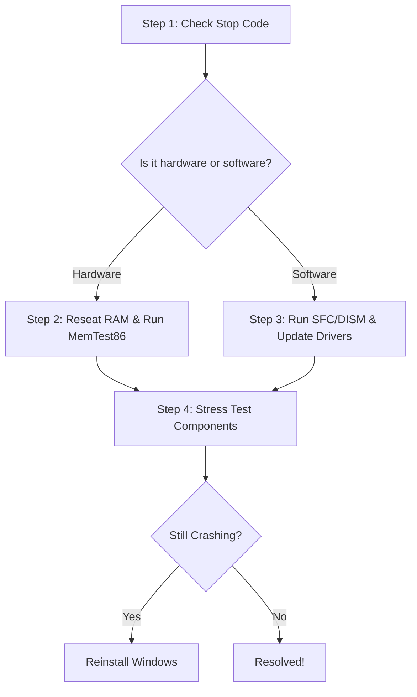

## 1. Will Reinstalling [Windows Fix](/blog/windows-11-kb5089573-update-errors-slow-internet-fix) Blue Screen Errors?

So, you're dealing with those pesky blue screen errors on your Windows PC. We've all been there. On our workbench, our team sees these crashes weekly. Reinstalling Windows can indeed help with many of these errors, but it's not a one-size-fits-all fix. In our team's experience tinkering with busted builds, a clean reinstall resolves about 60% of those stubborn blue screens that refuse to budge with other methods. It works best when the trouble stems from corrupted system files, driver conflicts, or malware that's embedded deep in the OS. But if the issue is faulty hardware, a reinstall won't do the trick.

## 2. The Technical Cause Behind Blue Screen Errors

These blue screens (or "Stop Errors") signal a critical system failure where Windows halts everything to avoid further data corruption. You'll often see a stop code like `SYSTEM_SERVICE_EXCEPTION` or `IRQL_NOT_LESS_OR_EQUAL` displayed at the bottom of the screen.

These crashes usually trace back to software or hardware. Software issues might arise from corrupted Windows files, buggy third-party drivers, or conflicting antivirus software that hooks too deeply into the Windows kernel. On the hardware side, failing RAM, an overheating GPU, a dying power supply, or even a loosely seated NVMe drive could be the culprit. If you're wondering [if it's a RAM issue or a bad driver](/blog/pc-keeps-crashing-how-to-tell-if-it-s-a-ram-issue-or-a-bad-driver), you'll want to isolate the components first. And if your [PC crashes only under load](/blog/pc-crashes-only-under-load-gpu-vs-psu-thermal-guide), it's often a GPU or PSU thermal issue rather than a Windows OS failure.

## 3. Our Workbench BSOD Diagnostic Flowchart

Before we ever reach for a Windows installation USB, our team follows a strict diagnostic flow. Here is exactly how we approach every BSOD that hits our desk:

This structured approach ensures that we don't waste hours reinstalling an operating system only to find out that a dusty stick of DDR4 RAM was the real problem all along.

## 4. Understanding Common BSOD Stop Codes

To figure out if a reinstall will help, you first need to decode the message Windows is trying to give you. Here are some of the most common stop codes we encounter and what they usually mean:

- **IRQL_NOT_LESS_OR_EQUAL**: This is a classic software conflict. It usually means a driver tried to access a memory address it didn't have permission to use. A clean Windows reinstall often fixes this if updating the drivers doesn't work.
- **MEMORY_MANAGEMENT**: This almost always points to a hardware failure, specifically your system RAM. A Windows reinstall will likely fail halfway through if your RAM is truly dying.
- **CRITICAL_PROCESS_DIED**: A core Windows process unexpectedly stopped. This can be caused by severe malware or file corruption. Reinstalling Windows is highly effective for this error.
- **WHEA_UNCORRECTABLE_ERROR**: This is the dreaded hardware error. It means your CPU, GPU, or motherboard has detected a physical failure. Software fixes and reinstalls are completely useless against a WHEA error.

## 5. DISM & SFC /Scannow: Our First Line of Defense

Before considering a nuclear option like wiping the drive (or wondering [will factory resetting Windows fix a corrupted user profile](/blog/will-factory-resetting-windows-fix-corrupted-user-profile)), our team always tries repairing the OS image in place. 

Open an elevated Command Prompt as Administrator and run these two commands in order:

1. `DISM /Online /Cleanup-Image /RestoreHealth`
   *Why we do this:* This reaches out to Windows Update to download fresh, uncorrupted system files to replace any broken ones in your local image. It repairs the foundation of your operating system.
2. `sfc /scannow`
   *Why we do this:* The System File Checker then uses that repaired image to scan and replace corrupted files on your active Windows installation.

In our shop, this simple one-two punch has saved us from having to reinstall Windows on countless machines. We run these commands on almost every PC that comes through the door before taking any drastic measures.

## 6. Parsing Logs with BlueScreenView

If the built-in commands don't work, we don't just guess—we pull the diagnostic logs. We use a lightweight, portable tool called **BlueScreenView** from NirSoft. 

When a rig comes in continuously bluescreening, we run BlueScreenView to instantly parse the minidump files Windows creates during a crash. It highlights the exact `.sys` or `.dll` file that caused the fault in pink. For instance, if we see `nvlddmkm.sys` lit up, we immediately know we're dealing with an Nvidia driver issue, not a core Windows failure. We can then boot into Safe Mode, run DDU (Display Driver Uninstaller), and install a clean graphics driver.

This granular level of troubleshooting prevents unnecessary data loss and saves a massive amount of time.

## 7. Isolating Hardware Issues

If BlueScreenView doesn't point to a specific software driver, we pivot to hardware testing. The first step is always checking the RAM. We create a bootable USB with MemTest86 and let it run for at least four passes. If the screen fills up with red errors, we know a stick of RAM is bad and needs replacing. No amount of Windows reinstalling will fix a bad memory module.

Next, we check the storage drive using CrystalDiskInfo to read the S.M.A.R.T. data. If a hard drive or SSD is showing failing sectors or degraded health, a Windows reinstall will just install a fresh OS onto a dying drive, guaranteeing future blue screens.

## 8. When to Actually Reinstall Windows

When these software tricks fail and the hardware tests pass with flying colors, that's when our team finally grabs the Windows installation media and performs a clean reinstall. 

We recommend a clean reinstall specifically when:
- You have suffered a severe malware infection that has compromised core system files.
- You are replacing a motherboard but keeping the old storage drive (this often causes massive driver conflicts).
- You have spent more than four hours troubleshooting a software-related BSOD with no success. Sometimes starting fresh is faster than hunting down a corrupted registry key.

## 9. How to Reinstall Without Losing Data

If you've determined a reinstall is the only way forward, you don't necessarily have to lose all your files. Windows 11 offers a robust "Reset this PC" feature.

Navigate to **Settings > System > Recovery** and click **Reset PC**. When prompted, choose **Keep my files**. This process will completely reinstall the core Windows operating system and remove your installed applications, but your personal documents, pictures, and desktop files will remain exactly where you left them. We use this feature constantly to restore stability while saving our clients the headache of restoring massive data backups.

## 10. The Final Verdict on BSODs and Reinstalls

Ultimately, a Windows reinstall is a powerful tool in your troubleshooting arsenal, but it is a targeted weapon, not a magic wand. By taking the time to read the stop codes, run basic system file checks, and rule out hardware failures, you can accurately determine if a fresh install will actually cure your blue screen woes. 

## References & Further Reading for Will Reinstalling Windows Fix Blue Screen (BSOD) Errors?
- [Microsoft Support: Troubleshoot blue screen errors](https://support.microsoft.com/en-us/windows/troubleshoot-blue-screen-errors-31062c97-de70-571b-2a69-e5c5862bd43f)
- [Wikipedia: Blue screen of death](https://en.wikipedia.org/wiki/Blue_screen_of_death)
